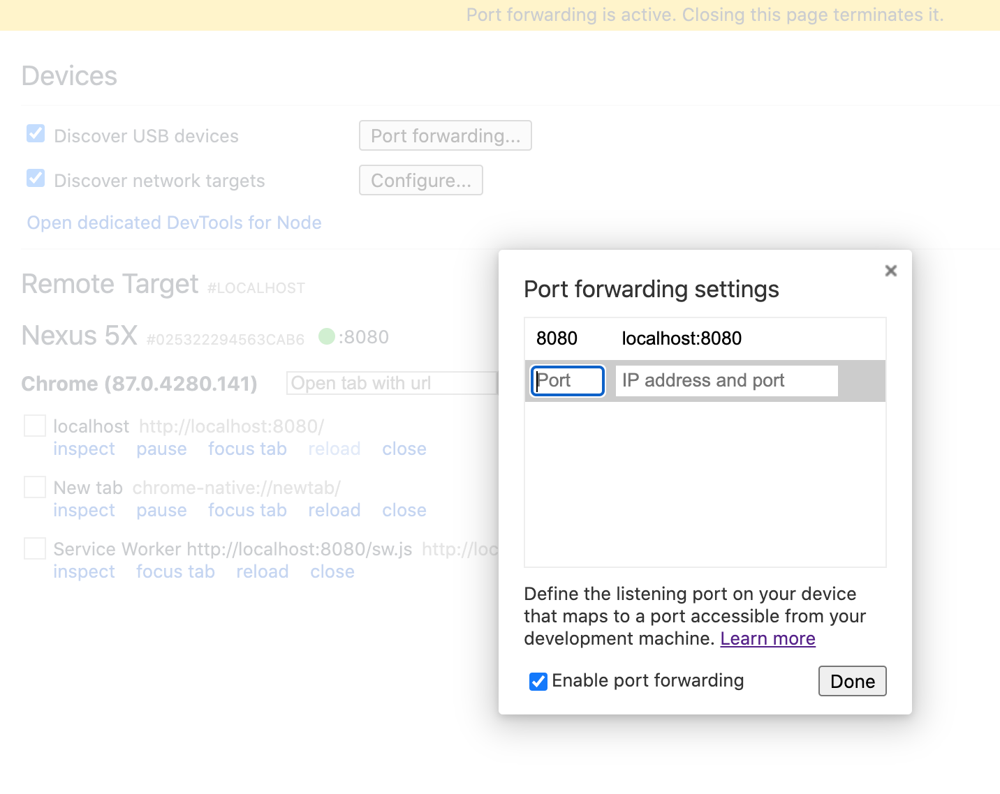
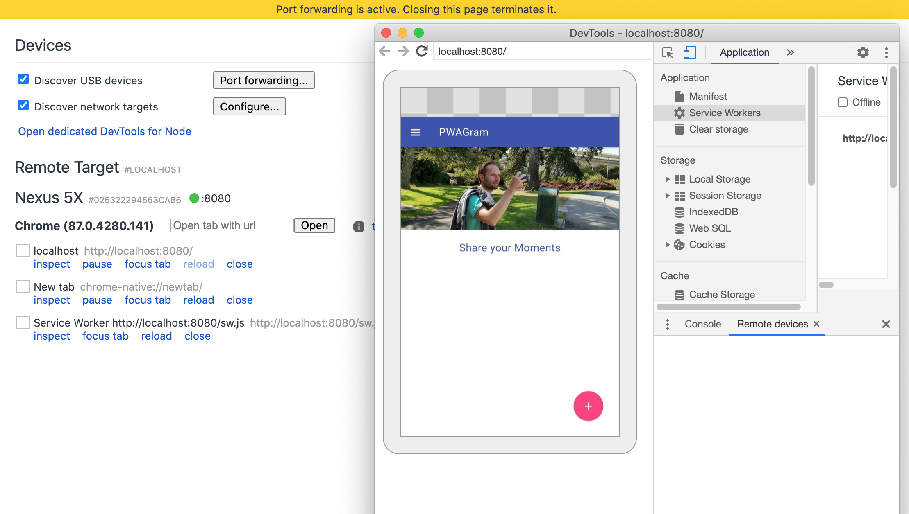

# Progressive Web Apps - Complete Guide

This source code is part of Maximilian Schwarzmüller's "Progressive Web Apps - Complete Guide" course on udemy.com.

# How to Use

You need [Node.js](https://nodejs.org) installed on your machine. Simply download the installer from [nodejs.org](https://nodejs.org) and go through the installation steps.

Once Node.js is installed, open your command prompt or terminal and **navigate into this project folder**. There, run `npm install` to install all required dependencies.

Finally, run `npm start` to start the development server and visit [localhost:8080](http://localhost:8080) to see the running application.

### Connect remote Android device to macOS desktop

1. follow this article: https://developer.chrome.com/docs/devtools/remote-debugging/ ( or another one : https://www.browserstack.com/guide/chrome-mobile-debugging)

2. map the ports as per screenshots below:

